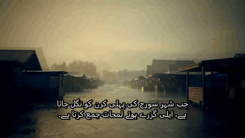
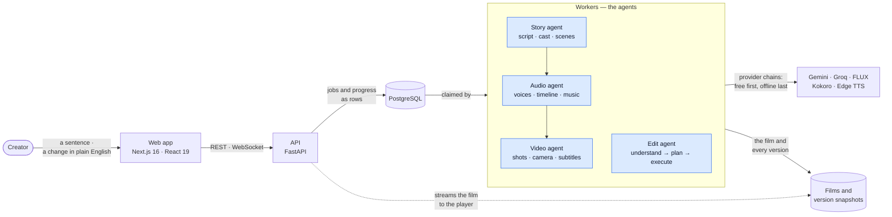

<h1>
  <picture>
    <source media="(prefers-color-scheme: dark)" srcset="docs/brand/lockup-dark.png">
    
  </picture>
</h1>

**One sentence in. A finished short film out — script, voices, pictures,
camera moves, music and subtitles. Then change it by saying what you want.**

A *dastango* is a teller of *dastans*, the long tales once performed by
lamplight in the old cities of South Asia. The mark is a Mughal arch — the
storyteller's niche, a stage, a screen — with the teller's lamp inside it.

[](https://github.com/SaadAbdullaH3/Automated-Story-Generation/actions/workflows/tests.yml)


[](https://139-185-59-132.sslip.io)



<sub>Six seconds of a real run, unedited. Every image, voice, cut, camera move
and subtitle in it was generated.</sub>

---

## What it does

1. **Write one sentence** — *"A clockmaker in a flooded city repairs the hours
   people lose."*
2. **Read the storyboard in ~20 seconds.** The script streams in first: every
   scene's tone, camera move and lines, with the voice that will speak each.
   Then each frame develops in. Fix anything before spending a render on it.
3. **Render the film.** Each character speaks in their own voice; every shot
   gets a camera move chosen for its job; music ducks under dialogue;
   subtitles in any of 14 languages are burned in, right-to-left scripts
   shaped correctly. Frame-exact.
4. **Change it in a sentence** — *"make the voices in scene 2 whispered"*. It
   says what it understood before re-rendering anything, re-renders only what
   changed, and keeps every cut. Going back is one click, and restores the
   film itself.

It runs live at **[139-185-59-132.sslip.io](https://139-185-59-132.sslip.io)**
on a free cloud VM. Sign-ups (email, or GitHub) are open during review
periods and closed otherwise; the clip above is a real run.

## How it works



A request never does the work: it writes a **job row** and returns. Workers
claim jobs atomically, run the agents through an orchestrator, and write
progress as rows the browser replays — so a run survives a restart, can be
watched from anywhere, and can be cancelled. Every step saves a **version**
with copies of its files, which is what makes undo exact.

→ [Software architecture](docs/ARCHITECTURE.md) ·
[Agentic architecture](docs/AGENTS.md) ·
[Every framework, and why](docs/TECH_STACK.md)

## What makes it more than a wrapper

- **The cheap half comes first.** A storyboard costs ~20 seconds and is
  edited before the render spends minutes — the preview is even drawn at
  render size so the render reuses it.
- **One timeline owns all timing.** Audio places lines on it, video cuts on
  its boundaries, subtitles read it. The voice used to drift 6 seconds ahead
  of the picture; now the final frame count equals the timeline's exactly.
- **Edits are understood, not guessed.** The model fills a closed form of
  edits the system can actually make; anything else is refused with what to
  say instead, never reported as done. A failed edit leaves the film exactly
  as it was.
- **Models are configuration.** Each role (script, edit, translation, image,
  voice, motion) is a chain in one YAML file with automatic fallback, free
  providers first and an offline path last. It costs $0 to run.
- **Claims are measured.** Pan smoothness by phase correlation (worst jump
  0.19 px), ducking per frequency band, speaking rate against real voices,
  render time sampled on the production server — where shots now render two
  at a time: **6 min 38 s → 4 min 52 s** for a 43-second film.
- **It is deployed, not just runnable.** HTTPS, accounts with GitHub sign-in,
  private films, nightly backups to the VM and to R2, and a restore proven by
  deleting everything and bringing it back.

## Quick start

**On a laptop — one process, no keys needed:**

```bash
python -m venv .venv
source .venv/bin/activate                         # Windows: .venv\Scriptsctivate
pip install -r requirements.txt
cd web && npm ci && npm run build && cd ..        # the creator UI (Node 22)
python main.py serve                              # http://localhost:8000
```

FFmpeg must be on `PATH`. With no keys everything runs offline (template
scripts, placeholder images); add free keys in `.env` for real models — see
[PROVIDERS.md](docs/PROVIDERS.md).

**From the command line:**

```bash
python main.py plan "A lighthouse keeper befriends a stranded whale" --scenes 3
python main.py render <project_id>
python main.py edit <project_id>        # edit> make scene 2 darker
```

**In containers — API, workers and Postgres:**

```bash
docker compose up --build --scale worker=3
```

**On a server** — from an empty Oracle Cloud free VM to HTTPS:
[deploy/README.md](deploy/README.md).

## Documentation

**For people making films:** the guide on the live site —
[139-185-59-132.sslip.io/docs](https://139-185-59-132.sslip.io/docs/) — covers
writing a prompt, the storyboard, rendering, every change you can ask for,
voices, subtitles and accounts.

**For engineers:**

| | |
|---|---|
| [Product brief](docs/PRODUCT.md) | The problem, who it is for, MVP scope, and how success is measured |
| [Software architecture](docs/ARCHITECTURE.md) | Context, containers, components, request flows, lifecycles, data model, deployment |
| [Agentic architecture](docs/AGENTS.md) | Orchestrator, the four agents, provider chains, the timeline, the edit agent, memory |
| [Technology stack](docs/TECH_STACK.md) | Every framework and model, where it is used and why |
| [Architecture decisions](docs/DECISIONS.md) | Fourteen decisions with their context, alternatives and costs |
| [API reference](docs/API.md) | REST endpoints and the progress WebSocket |
| [Models and providers](docs/PROVIDERS.md) | Configuring which model does what, free keys, voices, paid options |
| [Development](docs/DEVELOPMENT.md) | Setup, the CLI, repository layout, conventions, extending it |
| [Testing](docs/TESTING.md) | How 388 offline tests are built, what they cover, CI |
| [Security](SECURITY.md) | Threat model, authentication, authorisation, known gaps |
| [Deployment runbook](deploy/README.md) | Oracle Cloud VM, HTTPS, backups and restore |
| [Roadmap](docs/ROADMAP.md) | Known limitations and what comes next |
| [Changelog](CHANGELOG.md) | Milestones M0–M9 and what each measured |

## Built with

Python 3.11 · FastAPI · Pydantic v2 · SQLAlchemy Core · PostgreSQL · Next.js 16
· React 19 · TypeScript · FFmpeg · libass · Kokoro (onnxruntime) · Gemini ·
Groq · Cloudflare Workers AI (FLUX) · Docker Compose · Caddy · Oracle Cloud ·
Cloudflare R2 · GitHub Actions · pytest
