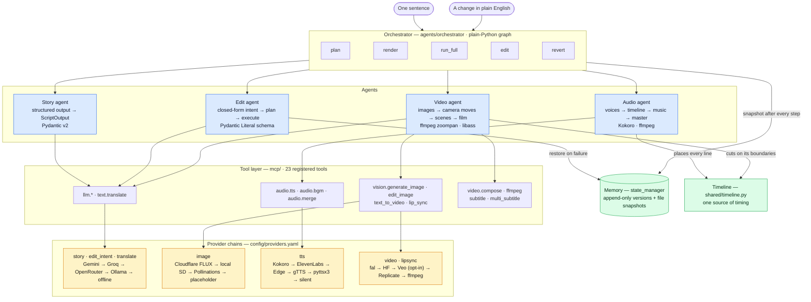
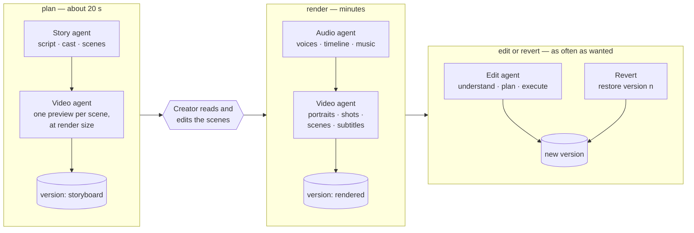
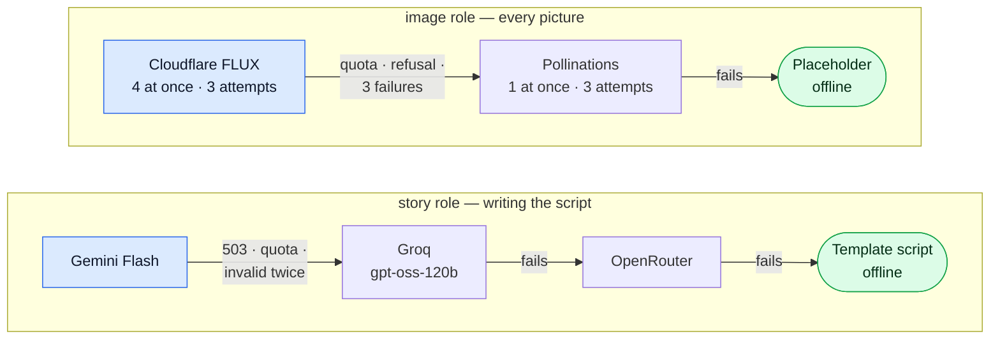
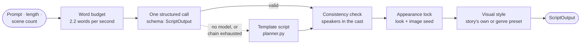
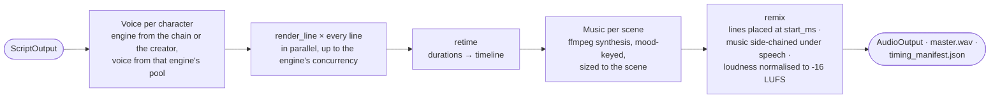
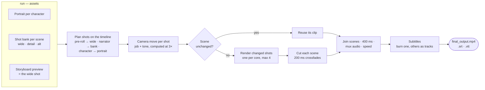
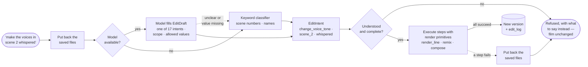
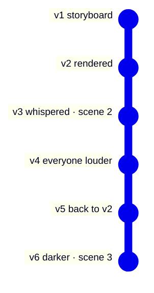

# Agentic architecture

Four agents, one orchestrator, a tool layer, and provider chains — designed so
that every model call is **structured, validated, replaceable and allowed to
fail**. The system around them (processes, queue, database, deployment) is in
[ARCHITECTURE.md](ARCHITECTURE.md).

- [1. The map](#1-the-map)
- [2. Design principles](#2-design-principles)
- [3. Orchestration](#3-orchestration)
- [4. Provider chains](#4-provider-chains)
- [5. Story agent](#5-story-agent)
- [6. Audio agent](#6-audio-agent)
- [7. Video agent](#7-video-agent)
- [8. The timeline](#8-the-timeline)
- [9. Edit agent](#9-edit-agent)
- [10. Memory: versions and undo](#10-memory-versions-and-undo)
- [11. The tool layer](#11-the-tool-layer)

---

## 1. The map

Every box names the framework or model doing the work.

---

## 2. Design principles

| Principle | What it means in the code |
|---|---|
| **Agents never name a model** | An agent asks for a *role* (`story`, `image`, `tts` …) and gets that role's chain from `config/providers.yaml`. Swapping Gemini for Claude, or adding a paid image model, is a YAML edit. |
| **Every model answer is a schema** | The script is a `ScriptOutput`, an edit is an `EditDraft` — Pydantic models sent to the provider as a native JSON schema where it supports one, validated on the way back. Malformed JSON is retried once with the validation error fed back to the model. |
| **Closed vocabularies where actions follow** | The edit model chooses from enumerated intents and values the executor can actually perform. An invented intent fails validation instead of becoming a silent no-op. |
| **Fail loudly, fall back visibly** | A provider that fails returns `success=False` or raises; the chain moves on and logs which provider served each result. Nothing ships degraded under a success label. |
| **Always an offline path** | A deterministic template script, a keyword edit classifier, placeholder images, silent audio of the right length. The whole test suite runs this way, with no keys. |
| **Human in the loop at the cheap moment** | The storyboard (script + one image per scene) is reviewed and edited before the expensive render. |
| **Edits reuse the render's primitives** | An edited film is built by the same `render_line → retime → remix → compose` steps as a new one, so the two cannot drift apart. |
| **Every step is undoable** | The orchestrator snapshots state and files after each step; "go back" is itself a new version. |

Why a plain-Python graph rather than LangGraph or CrewAI is decision
[ADR-002](DECISIONS.md#adr-002-a-plain-python-orchestrator-not-langgraph).

---

## 3. Orchestration

`PipelineOrchestrator` (`agents/orchestrator/workflow.py`) exposes five
operations. Each runs as a job on a worker, emits progress events, and ends in
a snapshot. `plan` and `render` are the product's normal path; `run_full` does
both without stopping (the CLI's default).

The graph is a small node executor (`agents/orchestrator/graph.py`): each node
is an agent step; `on_node` and `on_node_done` callbacks turn into progress
events; an exception stops the graph and becomes an `error` event. Between
nodes is also where a cancelled job stops — never inside an ffmpeg call.

---

## 4. Provider chains

`shared/providers.py` reads `config/providers.yaml` and returns, for a role,
the providers whose credentials are present, in order. Tools walk that list.

How a provider hands over:

- **Permanent errors** (400, 401, 403) move to the next provider at once.
- **Rate limits, 5xx and timeouts** retry with back-off where the provider has
  `retries:` — the free image endpoints get three attempts. A language model
  that is down is skipped immediately; the next one is faster than waiting.
- **A malformed structured answer** is retried once with the validation error
  added to the prompt.
- **Nothing counts until it validates:** an image must decode, JSON must match
  its schema, audio must not be empty.
- **Each provider has its own concurrency slot** (a semaphore), so a fallback
  that takes one request at a time is never flooded.

| Role | Chain (first available wins) | Offline end |
|---|---|---|
| `story` | Gemini Flash → Groq gpt-oss-120b → OpenRouter → OpenAI → Anthropic → Ollama | deterministic template |
| `edit_intent` | Gemini → Groq gpt-oss-20b → OpenRouter → Ollama | regex + keyword classifier |
| `translate` | Gemini → Groq → OpenRouter → Ollama → MyMemory | skip that language |
| `image` | Cloudflare Workers AI FLUX.1-schnell → local Stable Diffusion → SD WebUI → Pollinations → OpenAI | placeholder image |
| `tts` | Kokoro (local, onnxruntime) → ElevenLabs → Edge TTS → gTTS → pyttsx3 | silence of the right length |
| `video` | fal → Hugging Face → Veo 3.1 (needs `VIDEO_BUDGET_OK`) → Replicate | ffmpeg camera moves |
| `lipsync` | fal → Replicate | a heuristic mouth animation on the portrait |
| `music` | ffmpeg synthesis | — |

Details that came from running it, not from theory:

- **Reasoning models answer nothing at small token caps** (they spend the
  budget thinking), so every call has a 600-token floor.
- **Free endpoints rate-limit per IP.** Measured: keyless Pollinations answers
  one request at a time and returns 429 to the rest. The pool was once sized
  from the first provider's limit, so a fall-back from Cloudflare sent four
  requests at once and the run came back full of placeholders — hence a
  semaphore per provider.
- **A paid provider never becomes the default by being better.** Free
  providers come first; Veo needs a second, deliberate opt-in on top of a key.

---

## 5. Story agent

`agents/story_agent/` — one sentence in, a validated `ScriptOutput` out: the
story (title, logline, genre, visual style), the cast (with voice traits and a
visual description), and scenes (setting, tone, visual prompt, lines).

- **Length is a budget, not a hope.** The prompt states how many words fit;
  the 2.2 words/second figure was measured against the voices actually used,
  after the first benchmark found films running 17% long.
- **Characters keep their faces.** The appearance lock tops up each
  description with stable details the writer left vague and fixes a seed, so
  a character looks the same in every shot and after a re-render.
- **The look is the story's.** A horror short and a children's fable get
  different visual styles, and the wrong look goes into the negative prompt.

---

## 6. Audio agent

`agents/audio_agent/` — the script in, an `AudioOutput` and the film's
**timeline** out. Its three steps are public because edits reuse them.

- **Music ducks under dialogue** (`sidechaincompress`, measured ~6 dB while a
  line plays, recovering over the next second), so the bed can sit louder in
  the gaps.
- **Scene-only voices** (`AudioOutput.scene_voices`): "whisper in scene 2"
  stores an override for that scene, so a later "make everyone louder" makes
  scene 2 a louder whisper rather than undoing it.

---

## 7. Video agent

`agents/video_agent/` — assets first, then composition. `compose` is also
what every edit calls.

- **Frame-exact.** Each clip is rendered to an exact frame count, with extra
  frames to cover its crossfade, so crossfades never shorten the film and the
  final frame count equals the timeline's.
- **Smooth pans on stills.** `zoompan` positions its crop at whole pixels;
  computing the move at 3× and scaling down turns that into a fraction of an
  output pixel. Measured by phase correlation: up to 5.13 px/frame of travel
  with a worst frame-to-frame jump of 0.19 px.
- **Shots run side by side.** A shot keeps about one core busy (zoompan is
  single-threaded), so shots of every changed scene share one pool: on the
  2-core server a 43 s film went from 6 min 38 s to 4 min 52 s.
- **Subtitles are real text in every script.** Fonts are chosen per language
  and checked to cover it; a test burns each script and counts hollow
  "missing glyph" boxes.

---

## 8. The timeline

The single source of timing. Audio places lines on it, video cuts on its
boundaries, subtitles read its numbers. This is the start of a real film from
the server:

```mermaid
gantt
    title One timeline drives sound, picture and subtitles (seconds)
    dateFormat x
    axisFormat %S
    section Sound
    pre-roll, no speech          : 0, 1500
    line 1                       : 1500, 6662
    line 2                       : 6912, 9792
    scene 1 tail                 : 9792, 10392
    scene 2 pre-roll             : 10392, 11892
    line 3                       : 11892, 15625
    section Picture
    establishing wide            : 0, 1500
    shot for line 1              : 1500, 6912
    shot for line 2              : 6912, 10392
    scene 2 establishing         : 10392, 11892
    shot for line 3              : 11892, 15625
    section Subtitles
    line 1                       : 1500, 6662
    line 2                       : 6912, 9792
    line 3                       : 11892, 15625
```

Every cut lands on a line's start. Boundaries are converted to frames from
**absolute** milliseconds (never by adding rounded durations), so rounding
error cannot accumulate: before this existed, the voice led the picture by
2.4 s in scene 1 and 6.1 s by scene 4.

---

## 9. Edit agent

`agents/edit_agent/` — a sentence in, a new version or an honest refusal out.

The 17 edits it can make, by what they change:

| Target | Edits |
|---|---|
| Audio | `change_voice_tone` · `change_voice` · `adjust_volume` · `add_background_music` · `remove_background_music` · `regenerate_audio` |
| Picture | `apply_filter` · `adjust_scene_aesthetic` · `regenerate_scene` · `change_character_design` |
| Film | `remove_subtitles` · `add_subtitles` · `speed_up` · `slow_down` · `recompose_video` |
| Script | `regenerate_script` · `change_genre` |

Why the closed form exists: with free-form JSON, a live model classified
"make the voices in scene 2 whispered" as an invented intent with an invented
parameter; the planner fell back to re-recording, and the film came back
identical — reported as success. Measured after the change against both live
models: every real phrasing mapped correctly (including "the recipe scene
should feel darker" → scene 2 by its title), and "make it better" came back
as *unclear* and was refused.

---

## 10. Memory: versions and undo

The agents' memory is the version history. Every plan, storyboard edit,
render, edit and revert appends a version with the full state and a copy of
every file it refers to.

History is linear: going back to v2 creates v5 with v2's state and files, so
v3 and v4 remain reachable. Measured: the revert's film is byte-identical to
v2's.

---

## 11. The tool layer

`mcp/` is an internal tool registry (not the Model Context Protocol). Tools
register on import; agents call
`ToolExecutor().execute("audio.tts", ...)` and get a
`ToolResult(success, data, error, metadata)`, where `metadata` records which
provider actually served the call. `safe_run` turns exceptions into failures,
so one tool's crash is a result the agent can act on.

| Category | Tools |
|---|---|
| LLM | `llm.text_generate` · `llm.json_structure` · `text.translate` |
| Audio | `audio.tts` · `audio.bgm` · `audio.merge` |
| Vision | `vision.generate_image` · `vision.edit_image` · `vision.style_transfer` · `vision.text_to_video` · `vision.lip_sync` |
| Video | `video.compose` · `video.ffmpeg` · `video.image_to_clip` · `video.subtitle` · `video.multi_subtitle` |
| System | `system.file_read` · `system.file_write` · `system.file_delete` · `system.log` · `system.state_snapshot` · `system.state_revert` · `system.state_history` |

Adding a provider is a `_provider_<name>` method (images) or an adapter in
`mcp/tools/llm_tools/llm_client.py` (models), plus an entry in
`config/providers.yaml` — never an `if os.getenv(...)` in an agent.
