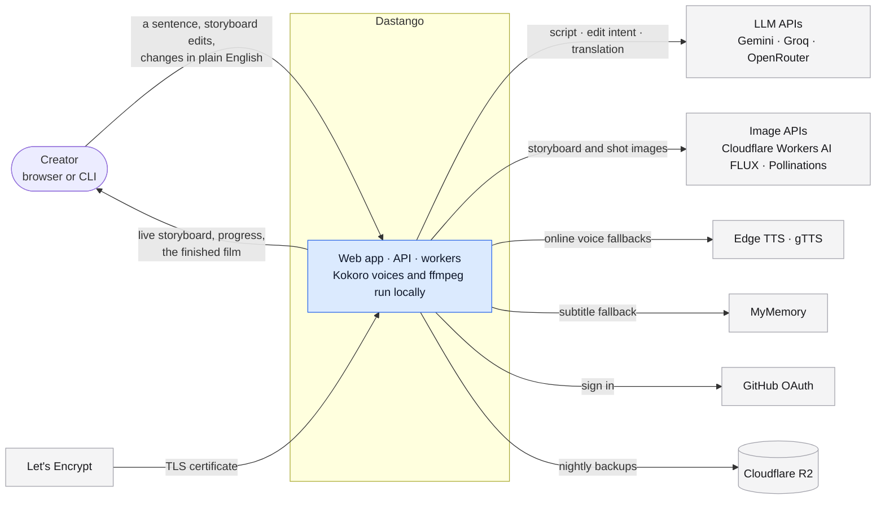
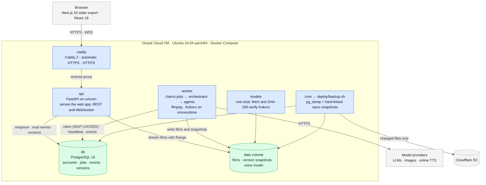
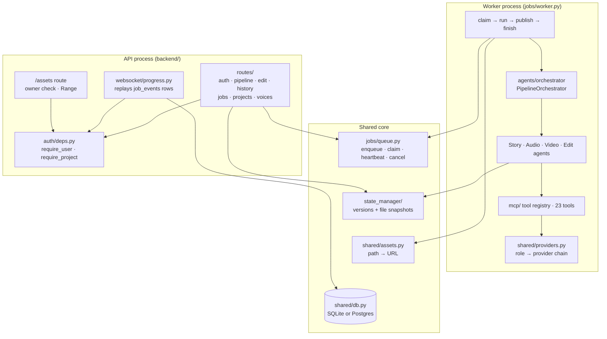
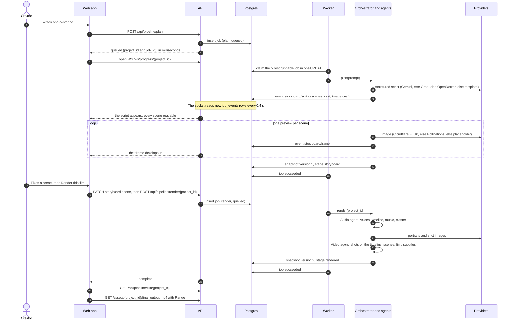
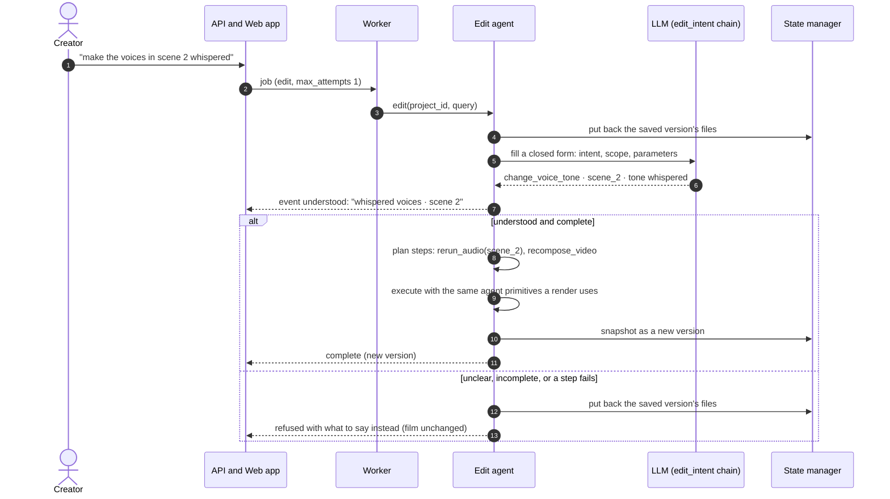
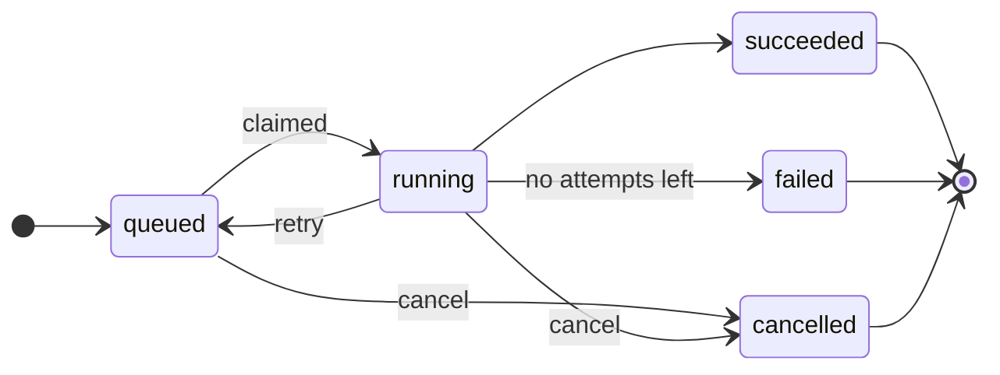
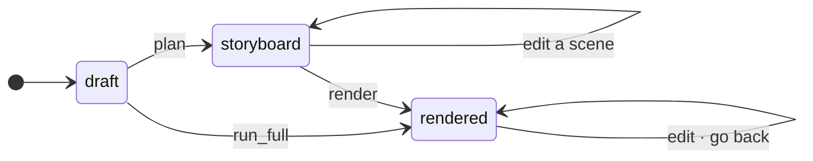
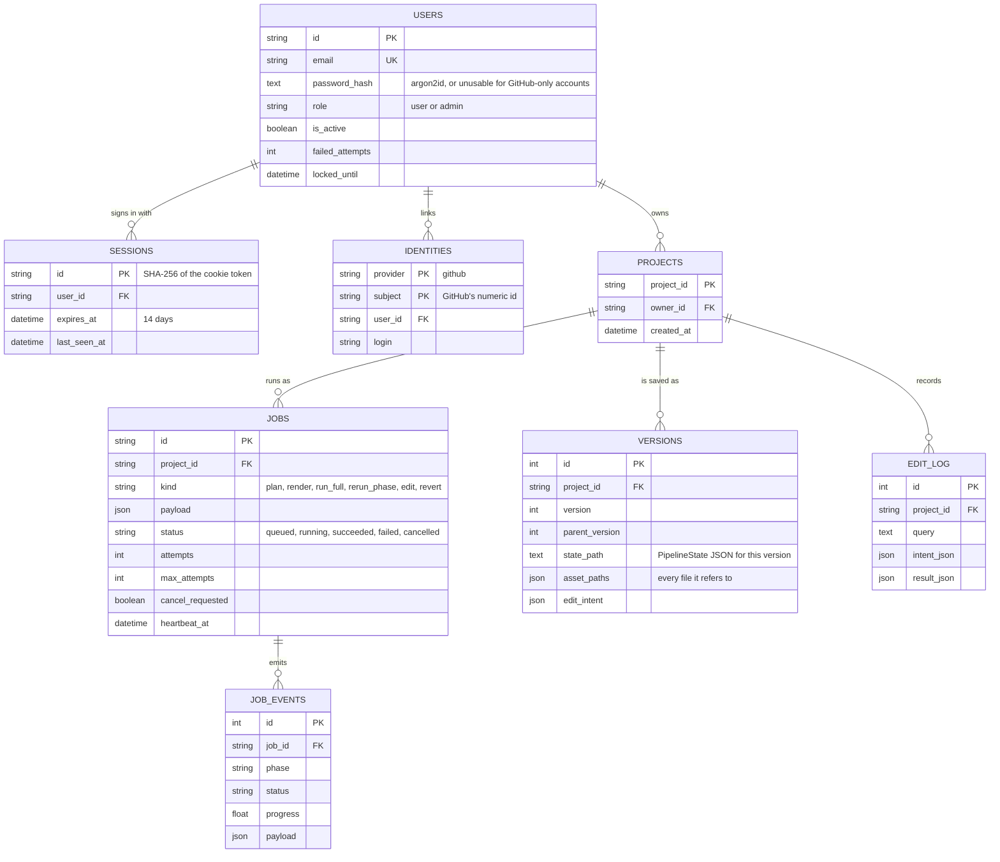
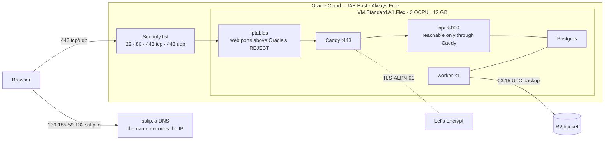
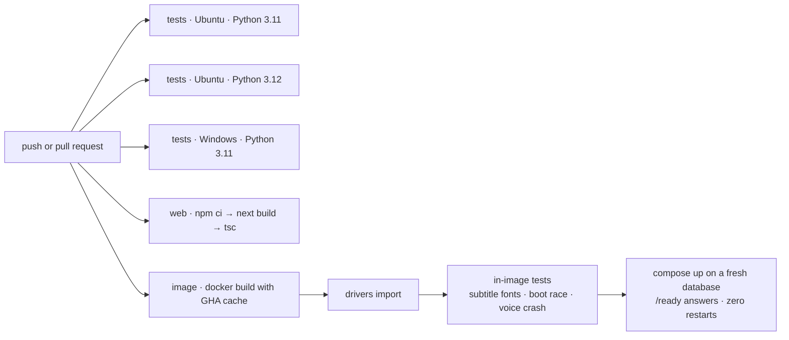

# Software architecture

How the system is put together, from the outside in: what it talks to, the
processes it runs as, the components inside them, how a request becomes a
film, and the data that persists. The agents themselves (how a prompt becomes
a script, voices and shots) are in [AGENTS.md](AGENTS.md); every framework
and why it was chosen is in [TECH_STACK.md](TECH_STACK.md).

- [1. System context](#1-system-context)
- [2. Containers](#2-containers)
- [3. Components](#3-components)
- [4. Making a film, end to end](#4-making-a-film-end-to-end)
- [5. Editing a finished film](#5-editing-a-finished-film)
- [6. Lifecycles](#6-lifecycles)
- [7. Data model](#7-data-model)
- [8. Deployment](#8-deployment)
- [9. Cross-cutting concerns](#9-cross-cutting-concerns)

---

## 1. System context

One product, one origin. A creator uses the web app (or the CLI); everything
the product cannot do on its own machine (language models, image models,
online voices) is a provider behind a swappable chain, and every chain ends
in something that works offline.

| External system | Used for | If it is down |
|---|---|---|
| Gemini, Groq, OpenRouter | Writing the script, reading an edit, translating subtitles | The next model in the chain answers; with none, a deterministic template writes the script and a keyword classifier reads edits |
| Cloudflare Workers AI, Pollinations | Storyboard and shot images | The next provider draws it; a local placeholder guarantees a file exists |
| Edge TTS, gTTS | Voices when Kokoro is not installed | Kokoro runs offline; silence of the right length keeps timing intact |
| MyMemory | Subtitle translation when no LLM can | That language is skipped; an English track is never shipped under a foreign label |
| GitHub | Optional sign-in | Email and password still work |
| Cloudflare R2 | Off-machine copy of the nightly backup | Local snapshots on the VM still exist |

---

## 2. Containers

The production stack is five services in Docker Compose on one VM. The API and
the workers share nothing but the database and the data volume, so workers
scale out (`--scale worker=3`) and a render survives an API restart.

| Service | Image | Health |
|---|---|---|
| `caddy` | `caddy:2-alpine` | Obtains and renews the certificate itself |
| `api` | the app image (`Dockerfile`, multi-stage: Node 22 builds the UI, Python 3.11 runs it) | `GET /health` |
| `worker` | the same image, `python main.py worker` | Touches a file each time it reaches the queue; stale for 2 min → unhealthy |
| `db` | `postgres:16-alpine` | `pg_isready` |
| `models` | the app image, runs once per start | Fetches and SHA-256-verifies the model; a failed download never blocks the app; voices fall back to Edge TTS |

On a laptop the same code runs as **one process**: `python main.py serve`
starts the API with a worker thread inside it and uses a SQLite file in WAL
mode. Nothing in the agents knows which of the two it is running in.

---

## 3. Components

Inside the two processes. Arrows point from caller to callee; the database is
the only thing the API and the worker have in common.

| Component | Path | Responsibility |
|---|---|---|
| Routes | `backend/routes/` | HTTP contract. Starting work means enqueueing a job and answering in milliseconds with its id. |
| Auth dependencies | `auth/deps.py` | **The only place a request becomes a user.** Declared on the routers, so a new endpoint is protected the moment it exists. |
| Progress | `backend/services/progress.py`, `backend/websocket/` | Streams a project's job events to the browser by reading rows (every 0.4 s), so a reload or a worker on another host loses nothing. |
| Job queue | `jobs/queue.py` | Runs are rows. One atomic `UPDATE` per claim; one job per project at a time, in order. |
| Worker | `jobs/worker.py` | Claims, heartbeats every 15 s, runs the orchestrator, publishes assets, records the outcome. |
| Orchestrator | `agents/orchestrator/` | `plan`, `render`, `run_full`, `edit`, `revert`: each a small graph of agent steps that emits progress events. |
| Agents | `agents/*_agent/` | The work: script, voices, pictures, edits. See [AGENTS.md](AGENTS.md). |
| Tool layer | `mcp/` | An internal registry of 23 tools (`audio.tts`, `vision.generate_image`, `video.compose`, …). Each tool walks its provider chain. Not the MCP protocol. |
| Providers | `shared/providers.py`, `config/providers.yaml` | Which model serves each role, in order. Agents never name a model. |
| State manager | `state_manager/` | Append-only version log plus a copy of every file a version refers to; revert is a new version. |
| Timeline | `shared/timeline.py` | The single source of timing for audio, cuts and subtitles. |
| Assets | `shared/assets.py` | The only place a file path becomes a URL. |

---

## 4. Making a film, end to end

The storyboard is the product's central idea: the cheap half (script and one
picture per scene, ~20 s) is shown and edited **before** the expensive half
(voices and shots, minutes) is spent.

Why each step is shaped this way:

- **A job, never work inside the request.** A render takes minutes;
  as a row it survives an API restart, can be watched from any process, and
  can be cancelled.
- **Events are rows.** The browser's socket replays the job from the first
  event on connect and de-duplicates by row id, so a reload mid-render shows
  exactly what a continuous connection would have.
- **The preview is drawn at the render size**, so the render reuses it as the
  scene's establishing shot instead of paying for the same image twice.
- **Snapshots after every step** make a storyboard edit as undoable as a
  render.

---

## 5. Editing a finished film

An edit is a job too, and it either completes as a new version or leaves the
film exactly as it was.

Going back ("Go back" in the UI, `POST /api/history/{id}/revert/{n}`) restores
version *n*'s state and files and saves the result as a **new** version, so
history stays linear and nothing is ever lost.

---

## 6. Lifecycles

### A job

- **retry** happens when a run fails with attempts left (after a 5 s
  back-off), or when its worker stops heartbeating for 120 s: a crashed or
  killed worker's job goes back on the queue.
- **cancel** stops a queued job at once and a running one at its next step
  boundary.
- A claim skips any job whose project still has an **older unfinished job**,
  so two workers can never run two changes to one film at once, decided by
  that row's existence, which holds under `SKIP LOCKED`.
- Pipeline runs get two attempts; edits and reverts get one (a half-applied
  edit is rolled back, not retried).
- Cancellation is cooperative and lands between pipeline steps, never in the
  middle of an ffmpeg call, so a cancelled run leaves no half-written file.

### A project

Every arrow saves a version: a storyboard edit, a render, an edit and a "go
back" are all undoable the same way.

---

## 7. Data model

One database holds the version log, the job queue, and accounts: SQLite by
default, PostgreSQL in production, the same SQL through SQLAlchemy Core.

The **`PipelineState`** (Pydantic, `shared/schemas/pipeline.py`) is the one
object passed between phases and versioned: `script` (story, cast, scenes and
lines), `audio` (voices, per-scene voice overrides, timing manifest, master
track), `video` (frames, shots, portraits, subtitle tracks, speed), the
storyboard, the stage, and per-phase status. Each version stores its state as
JSON plus copies of every file the state refers to, which is what makes
"go back" restore the film itself and not only its description.

On disk, everything lives under `DATA_DIR` (default `./data`):
`outputs/<project_id>/` for the current files, `state_versions/` for each
version's copies, and the SQLite file when not using Postgres.

---

## 8. Deployment

Live at **https://139-185-59-132.sslip.io** on Oracle Cloud's Always Free ARM
VM. The step-by-step runbook is [deploy/README.md](../deploy/README.md).

| Concern | How |
|---|---|
| HTTPS | Caddy obtains and renews a Let's Encrypt certificate; `sslip.io` gives a real hostname without buying a domain |
| Only one way in | The API publishes no port in production; it is reachable only through Caddy, which is what makes trusting `X-Forwarded-*` safe |
| First boot | API and worker race to create the schema; Postgres takes an advisory lock, SQLite retries |
| Secrets | `.env` on the server, mode 600, never in git; compose pins container paths over anything in it |
| Backups | Nightly `pg_dump` + rsync snapshot hard-linked to the previous night (7 kept), and the changed files pushed to R2 (14 dumps kept) |
| Restore | `deploy/restore.sh latest` or `bucket`; both proven by deleting the data and restoring it |
| Updates | `git pull`, rebuild, `docker compose up -d` once no job is running |
| Speed | 2 OCPUs: a 43 s, 5-scene film renders in 4 min 52 s with shots drawn two at a time |

### Continuous integration

The suite is fully offline (a mock LLM, placeholder images and silent voices),
so CI needs no secrets and spends no one's quota.

---

## 9. Cross-cutting concerns

**Failure is visible, never silent.** A provider that fails returns
`success=False` or raises; the chain moves on and the log says which provider
served each image. Translation that fails skips the language. An edit that
cannot be carried out is refused, not reported as done. A render with every
image provider exhausted still completes, with placeholders, and says so.

**Timing has one owner.** `shared/timeline.py` places every line; video
converts *absolute* millisecond boundaries to frames (never durations), so
rounding cannot accumulate and the final video's frame count equals the
timeline's exactly.

**Work is idempotent where it is expensive.** A scene's clip is reused when
its shot plan and source images are unchanged (a signature over both), so an
edit to scene 2 re-renders scene 2. A storyboard preview drawn at render size
becomes the establishing shot.

**Concurrency is bounded by what each resource tolerates.** Image and voice
calls fan out to each provider's declared `concurrency`, with a semaphore per
provider so a fallback endpoint that takes one request at a time is never
flooded. Shots render one per core the process may use (at most four).

**Security is enforced in one place each.** Requests become users only in
`auth/deps.py`; paths become URLs only in `shared/assets.py`; another user's
project answers `404`, never `403`. See [SECURITY.md](../SECURITY.md).

**Observability.** Structured logs per phase and provider; the job table
answers "what ran, what failed and why" (`python main.py jobs --status failed`);
`/health` and `/ready` (database reachable) for the proxy and Compose.
