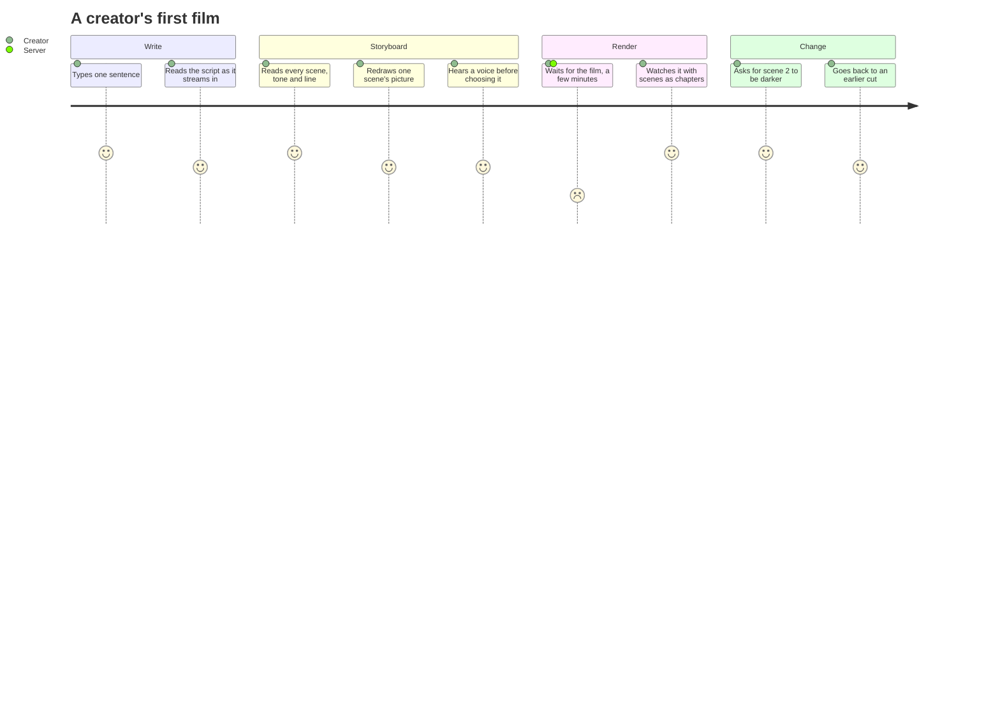

# Product brief: Dastango

## The problem

A thirty-second narrated short (a story for a channel, an explainer, a
lesson in Urdu) needs a writer, voices, pictures, an editor and subtitles.
Generative models can now do each of those jobs, but stitching them together
by hand gives films whose voices drift out of sync with the pictures,
characters whose faces change between shots, and no way to fix one thing
without starting again.

## Who it is for

**Content creators who make short narrative video** and don't have a studio:
storytellers posting shorts, educators, and anyone who needs the same film
with subtitles in another language. They think in scenes and lines, not in
models, prompts or timelines.

## What it does

One sentence in; a finished short film out, and then a conversation about it.

1. **Write** one sentence and choose a length.
2. **Storyboard** in about 20 seconds: the script streams in first, every
   scene's tone, camera move and lines readable while each frame is drawn.
   Fix any scene before spending anything on the render.
3. **Render**: each line spoken in the character's own voice, a camera move
   per shot, music ducked under dialogue, subtitles in any of 14 languages.
   Frame-exact.
4. **Change it in a sentence** ("make the voices in scene 2 whispered")
   and see what it was taken to mean before anything is re-rendered. Every
   cut is kept, and going back is one click.

## Scope of the MVP

| In | Out, deliberately |
|---|---|
| Prompt → storyboard → render, with the storyboard editable | Real video motion and lip sync (wired in, but every good provider is paid per clip) |
| Natural-language edits to voices, music, look, pace, subtitles and the script | Generated music beyond a synthesised, mood-keyed bed |
| Versioned history; going back restores the film itself | Sharing links, public gallery, collaboration |
| Voice choice with a sample, Kokoro by default | Payments and plans |
| 14 subtitle languages, burned in or as tracks, right-to-left shaped | Mobile apps |
| Accounts, GitHub sign-in, private films | Films longer than a few minutes |
| Deployed over HTTPS with tested backups | Multi-region, autoscaling |

## Constraints

- **$0 to run.** Every model has a free tier or an offline fallback, and the
  server is Oracle Cloud's Always Free VM. Paid providers are one
  configuration change away, never the default.
- **Honest output.** A degraded result says so; a change that wasn't made is
  never reported as made.
- **The creator's words, not the machine's.** "Recording the voices", not
  `phase2_audio`; "whispered voices · scene 2", not an intent name.

## How success is measured

| Measure | Target | Measured |
|---|---|---|
| Time to a storyboard | under 30 s | 18–20 s on the production server |
| Render time | minutes, not tens of minutes | 4 min 52 s for a 43 s, 5-scene film on 2 free ARM cores |
| Sync | every line on a cut | frame-exact; final frame count equals the timeline; 4/4 lines on cuts in the benchmark |
| Length accuracy | within 10% of the target | 2–6% with a live model; the offline template runs ~25% long |
| Edits understood | real phrasings map to the right change; nonsense is refused | 5/5 real phrasings on both live models; "make it better" refused |
| Undo | exact | a revert is byte-identical to the version it restores |
| Cost per film | $0 | $0 (SGD 0.00 of the cloud trial credit used) |
| Reliability | no lost work | runs survive restarts; a crashed worker's job is requeued; a failed edit leaves the film as it was |

See [ROADMAP.md](ROADMAP.md) for what comes next and the known limitations.
