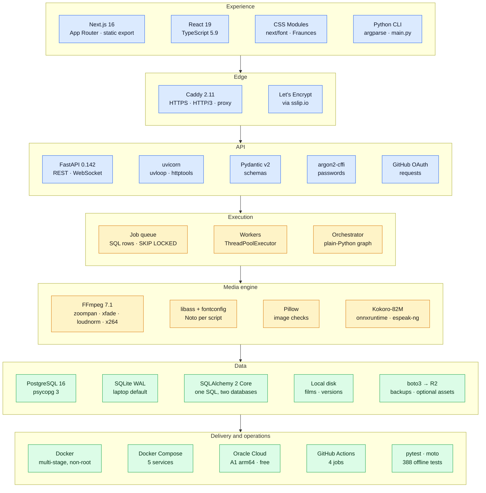
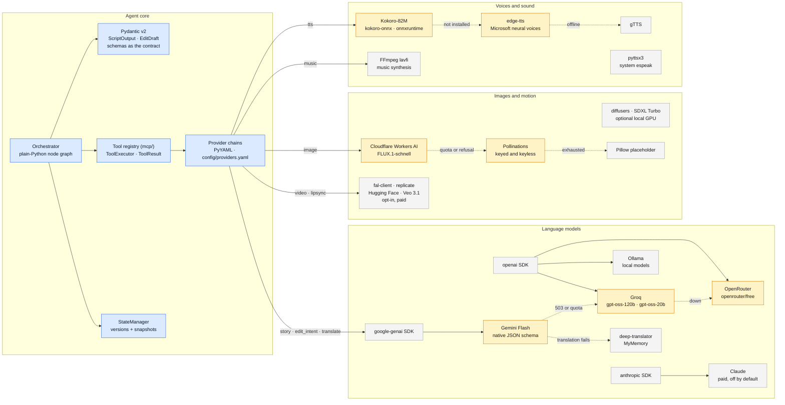

# Technology stack

Every framework, library, model and service the product uses: where it sits,
what it does there, and why it was chosen over the obvious alternative.
Versions are what the production image runs (October 2026); `requirements.txt` sets minimums, not pins.

- [Software architecture, by framework](#software-architecture-by-framework)
- [Agentic architecture, by framework](#agentic-architecture-by-framework)
- [The full inventory](#the-full-inventory)
- [What was deliberately not used](#what-was-deliberately-not-used)

---

## Software architecture, by framework

Each layer of the running system, with the framework that implements it.

---

## Agentic architecture, by framework

What each agent is built from, and which model or library serves each of its
calls. Solid arrows are the first choice; the chain continues to the right.

---

## The full inventory

### Product surface

| Framework | Version | Where | Why this one |
|---|---|---|---|
| **Next.js** (App Router, `output: export`) | 16.3 | `web/` | Static export means no Node server in production: FastAPI serves the built files from the same origin, so there is no CORS and one container. |
| **React** | 19.3 | `web/components/` | The storyboard streams in event by event; components re-render from server state only. |
| **TypeScript** | 5.9 (pinned) | `web/lib/types.ts` | API responses are typed end to end. Pinned below 6.x while Next 16's type-check path is proven on 5.9. |
| **CSS Modules + next/font** | with Next.js | `web/components/*.module.css`, `web/lib/fonts.ts` | Three modules and a token file are the whole design system. Fonts are self-hosted at build time, so a page load never calls Google. |
| **argparse CLI** | stdlib | `main.py` | Every operation the UI has, scriptable: `plan`, `render`, `edit`, `jobs`, `users`, `providers`. |

### API and execution

| Framework | Version | Where | Why this one |
|---|---|---|---|
| **FastAPI** | 0.142 | `backend/` | Async WebSocket and REST in one app, dependency injection for auth (`Depends(require_user)` declared per router), Pydantic validation at the edge. |
| **uvicorn[standard]** | 0.54 | `main.py serve` | ASGI server with uvloop and httptools; one process on a laptop, one container in production. |
| **Pydantic** | 2.13 | `shared/schemas/` | The cross-phase contract (`PipelineState`), the LLM output schemas, and API models are the same classes. |
| **SQLAlchemy Core** | 2.1 | `shared/db.py`, `jobs/queue.py` | One SQL text for SQLite and Postgres; `FOR UPDATE SKIP LOCKED` on Postgres. Core, not the ORM: the queue's claim is one hand-written atomic `UPDATE`. |
| **psycopg** | 3.3 | production database driver | The current Postgres driver; binary wheels exist for arm64. |
| **argon2-cffi** | 25.1 | `auth/passwords.py` | argon2id, the current OWASP recommendation; a dummy verify on unknown accounts keeps login timing uniform. |
| **requests / httpx** | 2.34 / 0.28 | providers, GitHub OAuth, tests | `requests` for provider HTTP; `httpx` is what FastAPI's `TestClient` needs. |
| **concurrent.futures** | stdlib | `shared/utils/parallel.py` | Image, voice and shot jobs fan out on threads; the heavy work is in ffmpeg and network I/O, which release the GIL. |

### Models and providers

| Service or model | SDK | Role | Why |
|---|---|---|---|
| **Gemini Flash** (`gemini-flash-latest`) | `google-genai` 2.28 | script, edit intent, translation | Free tier, native structured output (response schema); the alias survives model retirements. |
| **Groq**: `openai/gpt-oss-120b`, `gpt-oss-20b` | `openai` 3.24 | fallback for the same roles | Free and fast; reached through the OpenAI-compatible API, so it costs no new client code. |
| **OpenRouter** (`openrouter/free`), **Ollama** | `openai` | further fallbacks | A third free option and a fully local one. |
| **Claude, OpenAI** | `anthropic`, `openai` | paid options in the chain | Present so moving to a paid model is a YAML edit, not code. |
| **Cloudflare Workers AI: FLUX.1-schnell** | HTTP | images | 10,000 free neurons a day (~170 images), four at a time. |
| **Pollinations** | HTTP | images, fallback | Keyed (budgeted) and keyless endpoints; keyless is one request per IP. |
| **Kokoro-82M** | `kokoro-onnx` 0.6 on `onnxruntime` 1.30 | voices (default) | Apache-2.0, runs on CPU with no GPU and no torch; ~2 s a line on a laptop. Model files verified by SHA-256. |
| **Edge TTS**, **gTTS**, **pyttsx3** | `edge-tts` 7.2, `gTTS` 2.5 | voice fallbacks | Free online neural voices, then simpler ones; pyttsx3 only where the OS has a speech engine. |
| **MyMemory** | `deep-translator` 1.11 | subtitle fallback | Free, no key; used when no LLM can translate. |
| **fal.ai, Replicate, Hugging Face, Veo 3.1** | `fal-client`, `replicate`, HTTP, `google-genai` | real motion and lip sync (opt-in) | Every good option is billed per clip, so they sit behind the free path and Veo needs a second opt-in. |

### Media

| Tool | Where | What it does |
|---|---|---|
| **FFmpeg** (7.1 in the image) | `agents/video_agent/`, `mcp/tools/video_tools/`, `mcp/tools/audio_tools/` | Camera moves (`zoompan` at 3× size, `lanczos` down), crossfades (`xfade`), music synthesis (`lavfi`), ducking (`sidechaincompress`), loudness (`loudnorm` to -16 LUFS), encoding (`libx264`, AAC), speed (`setpts`, `atempo`), subtitle burn-in. |
| **libass + fontconfig** | `mcp/tools/video_tools/subtitle_tool.py`, `shared/fonts.py` | Right-to-left shaping for Urdu and Arabic; fonts chosen per language and checked to cover it (Noto Naskh Arabic, Noto Sans Devanagari, Noto Sans CJK, Segoe UI on Windows). |
| **Pillow** | `shared/utils/images.py`, `mcp/tools/vision_tools/` | Verifies every image decodes before ffmpeg sees it; placeholder images; colour filters for edits. |
| **soundfile, numpy** | `mcp/tools/audio_tools/tts_tool.py` | Writing Kokoro's samples to WAV. |

### Data, storage and delivery

| Tool | Where | Why |
|---|---|---|
| **SQLite (WAL)** | default database | Zero setup on a laptop; WAL lets the API and its worker thread both write. |
| **PostgreSQL 16** | production | Concurrent workers on separate hosts; `SKIP LOCKED`; advisory lock for first-boot schema creation. |
| **boto3 → Cloudflare R2** | `shared/assets.py`, `scripts/offsite_backup.py` | S3-compatible, free to 10 GB with no egress charge. Assets publish there only when `STORAGE_URL` says so; backups go there nightly. |
| **Docker** (multi-stage) | `Dockerfile` | Node 22 builds the UI; Python 3.11-slim runs everything with ffmpeg and the fonts; runs as uid 10001, never root. |
| **Docker Compose** | `docker-compose.yml`, `deploy/docker-compose.prod.yml` | The whole stack in one file; the prod override adds Caddy and removes the API's public port. |
| **Caddy 2** | `deploy/Caddyfile` | Automatic certificates and renewal, HTTP/3, security headers, in twenty lines of config. |
| **Oracle Cloud Always Free** | `deploy/README.md` | 2 OCPU / 12 GB arm64 for $0. |
| **sslip.io** | `DOMAIN` in the server `.env` | A real hostname for an IP, so HTTPS works without buying a domain. |
| **cron + rsync + pg_dump** | `deploy/backup.sh` | Nightly backups hard-linked to the previous night; restore is a tested script. |

### Quality

| Tool | Version | Use |
|---|---|---|
| **pytest** (+ pytest-asyncio, pytest-timeout) | 9.1 | 382 tests, fully offline: mock LLM, placeholder images, silent voices. |
| **moto** | 5.2 | A local fake of S3 for the backup and storage tests. |
| **FastAPI TestClient** (httpx) | with FastAPI | API, auth and WebSocket tests without a server. |
| **GitHub Actions** | hosted | Ubuntu 3.11 and 3.12, Windows 3.11, the web build and typecheck, and the production image built and tested on every push. |

---

## What was deliberately not used

| Not used | Instead | Why |
|---|---|---|
| LangGraph, CrewAI, AutoGen | A 50-line node graph | The pipeline is a fixed sequence with one human checkpoint; a framework would add a dependency and indirection without adding a capability. The node shape matches LangGraph's, so moving later is mechanical. ([ADR-002](DECISIONS.md#adr-002-a-plain-python-orchestrator-not-langgraph)) |
| Celery, RQ, Redis | Jobs as database rows | One fewer service to run and back up; progress, retries and cancellation are queryable SQL. Postgres `SKIP LOCKED` gives the same claim semantics. ([ADR-003](DECISIONS.md#adr-003-jobs-are-database-rows-not-a-broker)) |
| JWT | Opaque session tokens, hashed in the database | Sign-out and account disabling take effect immediately, with no denylist. ([ADR-006](DECISIONS.md#adr-006-sessions-in-the-database-not-jwts)) |
| An ORM | SQLAlchemy Core | The few queries that matter (the claim, the event replay) are clearer as SQL. |
| MoviePy, OpenCV | FFmpeg directly | Frame-exact control and one dependency; both were removed (265 MB) when nothing used them. |
| Tailwind, a component library | CSS Modules | Fewer dependencies and a smaller build for a small UI. |
| PyTorch | onnxruntime | Kokoro runs on onnxruntime without the ~2 GB torch install, on any CPU. |
| A managed PaaS | One VM with Compose | $0, and the whole stack (including the database) is under the project's control and backups. |
